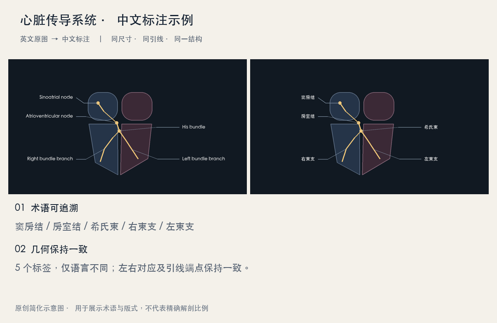

# 心脏传导系统标注示例



这是一幅原创简化示意图。英文版和中文版由相同的场景参数分别生成，只改变标签语言，展示五个核心术语、侧别对应和引线保持。它不代表精确解剖比例，也不作为 OCR、复杂照片修复或渲染脚本的性能测试。

## 完整文件

- [英文原图，1200 × 680](source.png)
- [中文版，1200 × 680](translated.png)
- [术语、编号、文字锚点与引线坐标](labels.json)

## 推荐提示词

```text
使用 $medical-figure-zh-labeler，将 source.png 中全部英文标签翻译成中文。
心血管术语优先检索《心血管病学名词（2025）》征求意见稿。
保持原图尺寸、结构、引线及端点不变；输出独立中文版和逐标签术语表。
复核左右对应、遗漏、遮挡和中文排版。
```

## 术语核对

| English | 中文 | A0 编号 |
|---|---|---|
| Sinoatrial node | 窦房结 | 03.052 |
| Atrioventricular node | 房室结 | 03.053 |
| His bundle | 希氏束 | 03.057 |
| Right bundle branch | 右束支 | 03.059 |
| Left bundle branch | 左束支 | 03.058 |

来源是配套翻译 skill 的 `references/terminology/cnterm-2025/03-02-anatomy.md`。表中条目均按“章节 + 编号 + 中文名”追溯，保留原稿“征求意见稿”状态。
