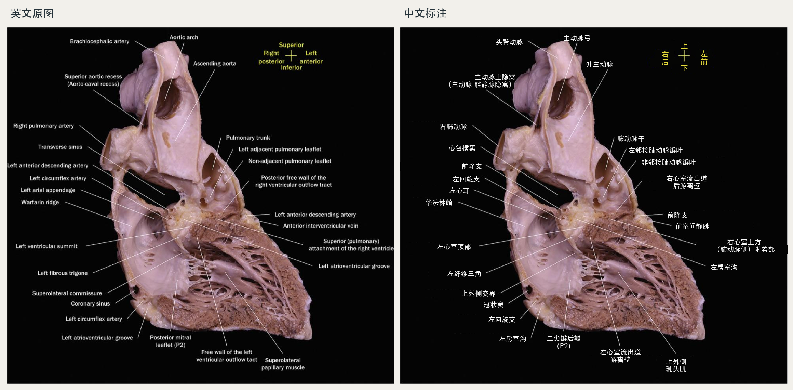
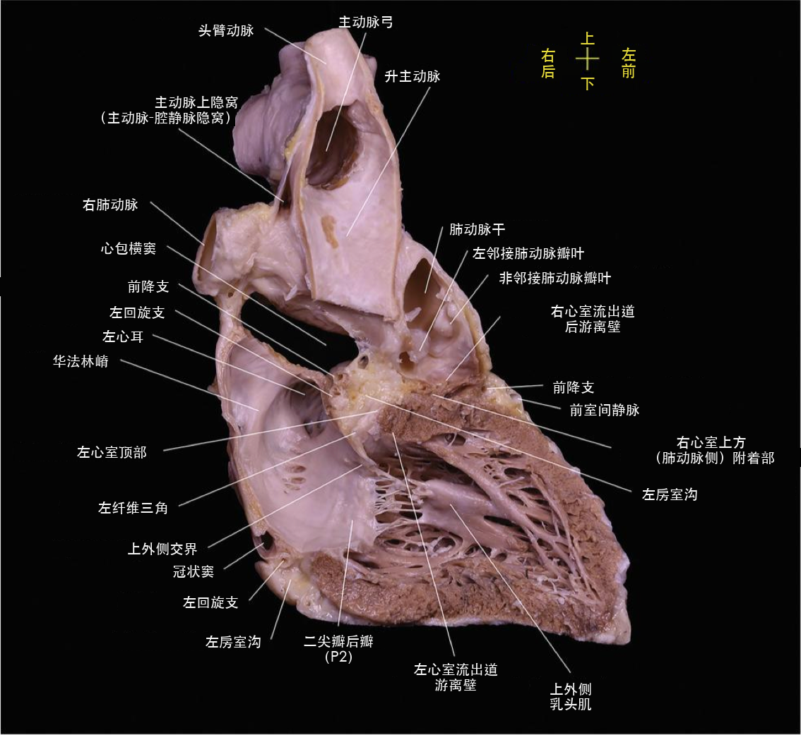

# 图6.12 · 医学图谱中文标注

本例使用用户提供的图6.12 截图，将上方解剖图精确裁切为独立图片，再按当前本机 skill 的术语规则替换英文标签。原图、中文版均为 **1134 × 1042**。



## 中文版



## 文件

- [英文裁切原图](source.png)
- [中文标注图](translated.png)
- [英文与中文对照](comparison.png)
- [英文原始 OCR 与坐标](ocr.json)
- [标签分组、中文定稿、对齐与字号](labels.json)
- [术语来源与裁决记录](terminology.md)
- [文字编辑区域掩膜](label-edit-mask.png)
- [尺寸与像素校验记录](verification.json)
- [截图裁切坐标](crop.json)

共 27 处解剖标签及 4 组中文方位标签；方位十字保留原始像素。中文标注采用白色文字、黄色方位标记，并保留引线和结构对应关系。图片通过 Python 精确裁切与文字覆盖制作；标签编辑区域之外的像素完全一致。通过原图逐标签视觉复核，修正 OCR 的 `arial`、`tact` 和 `muscie` 等识别或原文拼写异常。

心血管术语优先检索《心血管病学名词（2025）》征求意见稿；“前降支”“左回旋支”“左纤维三角”“冠状窦”等使用匹配的 A0 规范名。图中专名使用简洁中文，其英文保留在标签清单与术语表中。

## 推荐提示词

```text
使用 $medical-figure-zh-labeler，将 source.png 中的英文标注替换为中文。
优先检索 2025 A0 术语库，合并同一标签的 OCR 碎片。
保留照片、画布尺寸、引线及端点；普通文字用白色，方位标记用黄色。
输出独立中文版、标签清单和尺寸检查结果，逐标签复核。
```

同一截图的完整英文图注及中文译文见配套仓库的 [cardio-translate-zh 图注示例](https://github.com/lcj-xiaoluobo/cardio-translate-zh/tree/main/examples/fig-6-12)。
